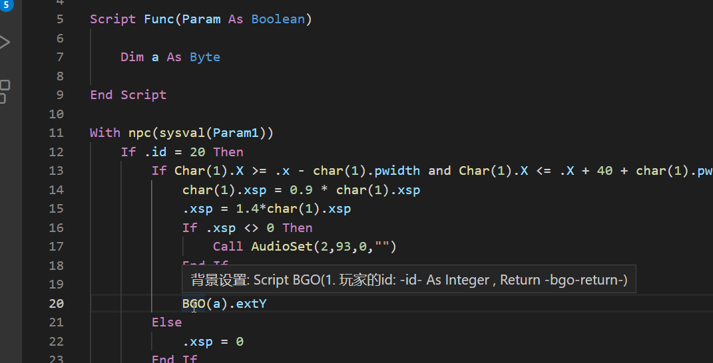
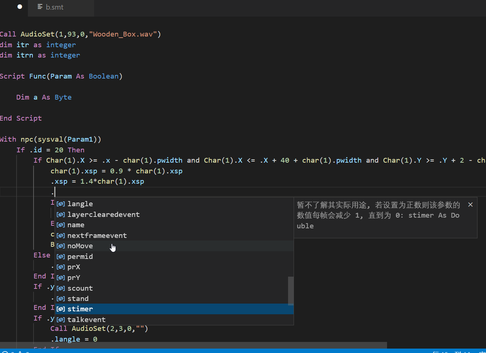

# VSC语言插件编写学习，以SMBX Teascript为例

这是一个VS code语言插件编写的学习案例，目标是搭建一个更方便的SMBX Teascript编码工具。关于SMBX Teascript的编码文档，可以移步[此处(Wiki)](https://wiki.smbx.world/wiki/Category:TeaScript.vbs)。

## 要实现的功能清单

-----
### 视觉优化

- [x] 基本语法高亮
- [x] 划分作用域
- [ ] 录入常用代码片段
- [x] 配置折叠
- [ ] 缩进规则

### 智能提示

- [x] 补全建议
- [x] 悬停提示
- [ ] 智能校验

-----

emmm……也是趁着毕业后和入职前这几天的空余时间找点事做。